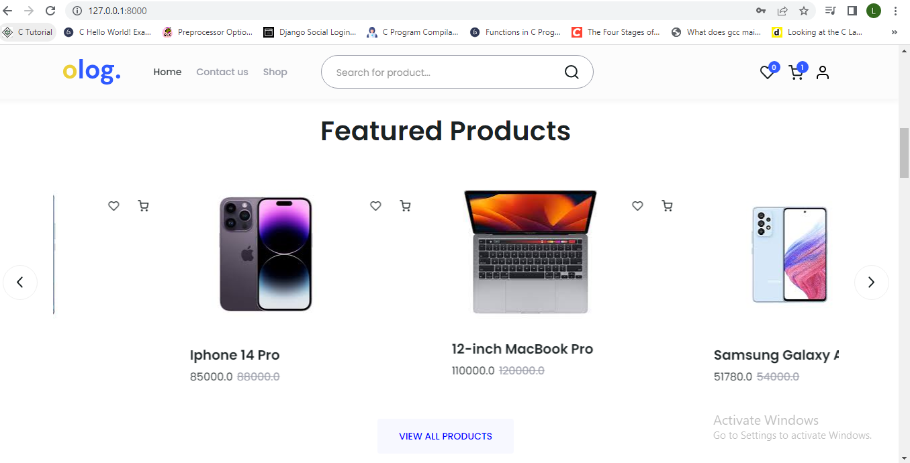

# Django  E-Commerce Website 
This is an e-commerce website built with Django 3.0 (Python)  for the backend and  
a bootstrap version [Olog eCommerce Responsive HTML Template](https://www.echotemplate.com/templates/olog-ecommerce-responsive-html-template) designed with HTML, CSS, SCSS, Bootstrap, Javascript & Jquery for the frontend,


### How to Install and Run this project?


##### Installation
**1. Create a Folder where you want to save the project**

**2. Clone this project**
```
$  git clone https://github.com/Lilywd/Smart-Stima.git
```

Then, Enter the project directory
```
$  cd Smart-Stima
```

**3. Create a Virtual Environment and Activate**


Create Virtual Environment

```
$  py -3 -m venv .venv
$  .venv\Scripts\activate.bat
$  code .
```


Activate Virtual Environment

```
$  .venv\Scripts\Activate.ps1
```

**5. Install Dependencies from 'requirements.txt'**
```
$  pip install -r requirements.txt
```

**6. Create a .env file**

- Got to the Stima folder and create a file called .env
- add the following 

* A new SECRET_KEY can be generated [here](https://www.miniwebtool.com/django-secret-key-generator/)

```
SECRET_KEY='your new secret key'

```

* For this you can use any smtp service you'd like, i used gmail smtp
```
EMAIL_HOST_PASSWORD='your password'
EMAIL_HOST='smtp.gmail.com'
EMAIL_FROM='your email'
EMAIL_HOST_USER='your email'

```


* Create an account on google console [here](https://console.cloud.google.com),create a project
```
SOCIAL_AUTH_GOOGLE_OAUTH2_SECRET='your google console app secret key'
SOCIAL_AUTH_GOOGLE_OAUTH2_KEY='your google console id'

```

* Go to [developers facebook](https://developers.facebook.com/)  click on My Apps and then Create App (If new click on Get Started and create your developer account). Fill in the app name and contact email and click on Create App ID.
```
SOCIAL_AUTH_FACEBOOK_KEY='your facebook developer client id'
SOCIAL_AUTH_FACEBOOK_SECRET='your facebook developer key'

```

* Go to [apps.twitter](https://apps.twitter.com) and click on Create an App
```
SOCIAL_AUTH_TWITTER_KEY='your twitter developer id' 
SOCIAL_AUTH_TWITTER_SECRET='your twitter developer key'
```
**8. Make migratations**

```
$ python manage.py makemigrations
```
```
$ python manage.py migrate
```


**9. Now Run Server**

```
$ python manage.py runserver
```


**10. Superuser Credentials**

Create Super User  for Admin Privileges

```
$  python manage.py createsuperuser
```

Then Add Email, Username, Firstname, Lastname, and Password

## Running the tests

Automated tests can be viewed in the tests folder within the separate Apps. 
To run the tests, in your terminal navigate to the folder with your project in, activate your virtual environment and type:

`$ python manage.py test <app name>`


#### Project Screenshots


###### `landing page`

<br>

###### `featured products`

<br>

###### `cart`

<br>

###### `shop`

<br>

###### `billing`

<br>

###### `shipping`

<br>

###### `payment`


